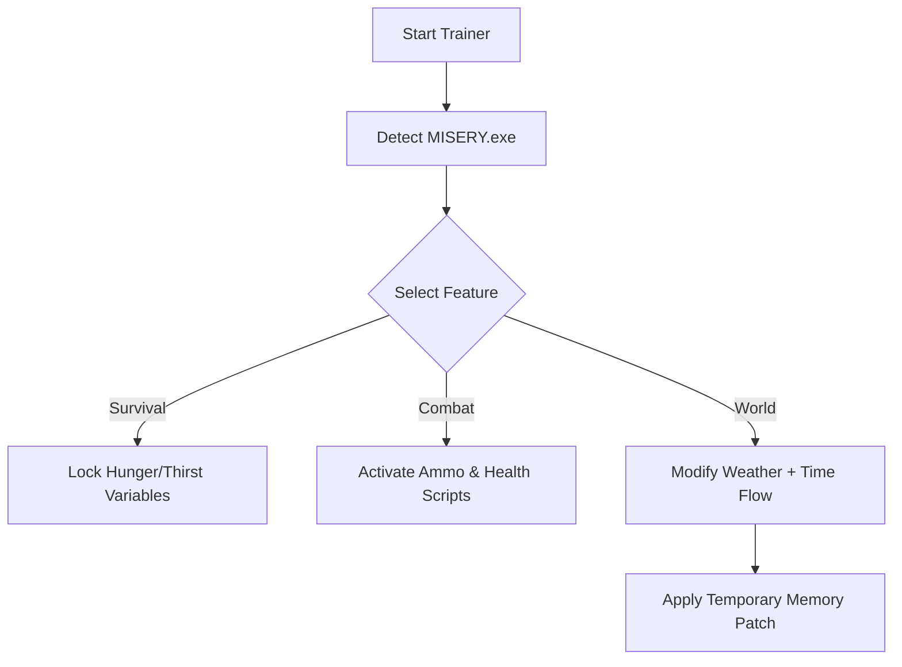

# ☣️ MISERY Trainer

The **MISERY Trainer** is built for players who crave control in the punishing world of *MISERY*. Whether you want to push realism further or balance the odds for experimentation, this tool provides advanced gameplay manipulation and full environment management — without altering the game’s core experience.

With real-time toggles and modular controls, you can customize stamina, combat, weather, and AI behavior — all from a clean in-game overlay.

---

## 🧠 Overview

This trainer acts as a **performance and balance layer** for *MISERY*, built to enhance immersion while offering optional convenience. It runs in the background, using safe injection methods to apply temporary tweaks to gameplay variables like health, hunger, fatigue, and enemy aggression.

> [!IMPORTANT]
> The MISERY Trainer modifies only active session values. No permanent files or save data are ever edited.

---

## ⚙️ Features

### Survival Management

* **Infinite Stamina Toggle** — Run and fight endlessly without exhaustion.
* **No Hunger or Thirst** — Maintain perfect physical condition.
* **Radiation Immunity** — Survive in extreme zones safely.

### Combat Enhancements

* **Unlimited Ammo & Fast Reload** for every firearm.
* **Instant Weapon Repair** — keep your arsenal in top shape.
* **One-Hit Kill** option for testing or speedruns.

### Environmental Controls

* Modify **weather cycles** (clear, storm, fog).
* Adjust **day/night speed** to match your style.
* Enable *Dynamic AI Freeze* for cinematic screenshots or exploration.

### Economy & Inventory

* Add rubles instantly.
* Unlock all crafting blueprints.
* Manage weight limits — go beyond encumbrance caps.

---

## 🧩 Compatibility

| Platform      | Supported         | Mode                               |
| ------------- | ----------------- | ---------------------------------- |
| Windows 10/11 | ✅ Fully Supported | Direct Injection                   |
| Steam         | ✅                 | Stable                             |
| GOG           | ✅                 | Compatible                         |
| Epic Games    | ⚠️                | Manual path configuration required |

> [!NOTE]
> Works best when *MISERY* is launched in **windowed borderless** mode to prevent overlay conflicts.

---

## ⚡ Setup & Usage

1. Download and extract the trainer files to your *MISERY* directory.
2. Run `MISERY_Trainer.exe` **as Administrator**.
3. Wait for the connection message:

   ```
   [✔] Game detected — trainer active.
   ```
4. Use the following default hotkeys:

| Action               | Hotkey |
| -------------------- | ------ |
| Open Menu            | F9     |
| Toggle Infinite Ammo | F1     |
| Toggle Stamina       | F2     |
| Toggle AI Freeze     | F3     |
| Add Rubles           | F4     |
| Repair Weapons       | F5     |
| Reset to Defaults    | F10    |

---

## 🕹 Trainer Workflow



---

## 🔧 Advanced Configuration

You can create a custom `.ini` profile for your preferred settings.
Example:

```ini
[Survival]
InfiniteStamina=True
NoRadiation=True

[Combat]
FastReload=True
OneHitKill=False

[World]
TimeScale=1.25
WeatherPreset=Clear
```

Save your file as `user_config.ini` in the trainer directory — it loads automatically each session.

---

## ❓ FAQ

**Q1: Will this cause bans in online play?**
❌ The trainer is **for single-player use only**. It does not support online or co-op sessions.

**Q2: Does it affect achievements?**
No. Achievements remain active unless Steam overlay is disabled.

**Q3: My overlay isn’t showing — what should I do?**
Switch your game to **DirectX 11** and relaunch the trainer before the main menu loads.

**Q4: Can I create hotkey macros?**
Yes. Go to `Controls > Custom Binds` and assign macros to multiple actions.

**Q5: How do I uninstall it?**
Simply delete the trainer folder — no registry edits are made.

---

## 🧠 Tips for Use

> [!WARNING]
> Using extreme stat modifiers can break certain story events. Always save before applying large-scale changes.

* Combine **AI Freeze** with **Free Camera Mode** for cinematic screenshots.
* Use **Weather Control** to test environmental lighting setups.
* Try **Dynamic Weight Limit** to simulate realistic progression.

---

## 🧾 Final Thoughts

The **MISERY Trainer** isn’t just a cheat tool — it’s a sandbox controller for those who love experimentation, modding, and stress-free exploration. Whether you want to test survival strategies or simply enjoy the atmosphere without constant struggle, this trainer lets you define your own version of difficulty.

---

**Survive smarter. Control deeper. Experience MISERY on your terms.**
